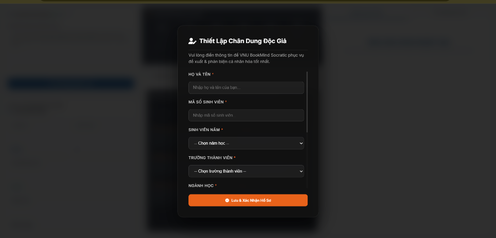
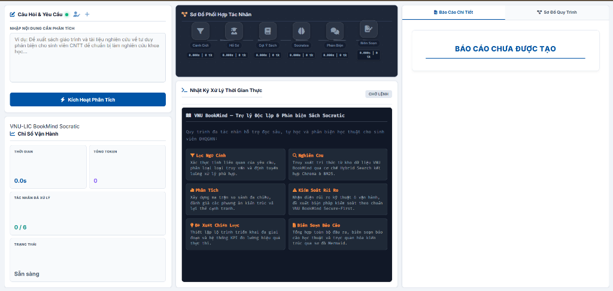
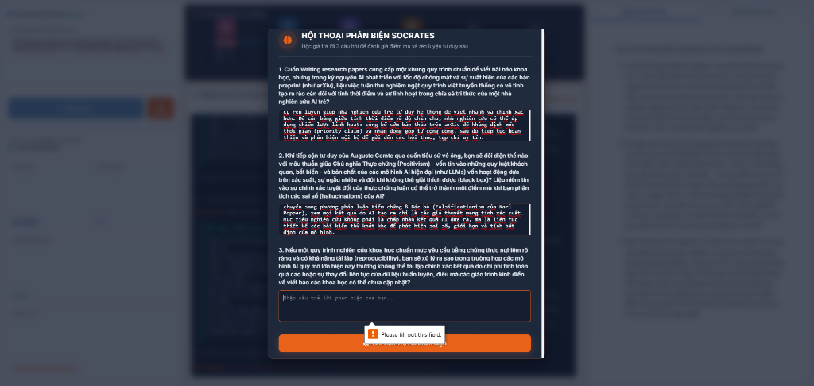
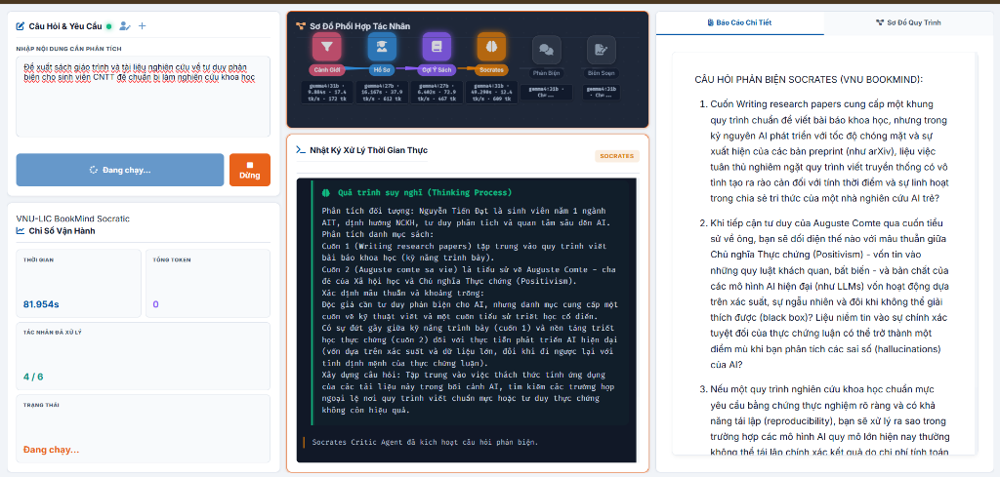
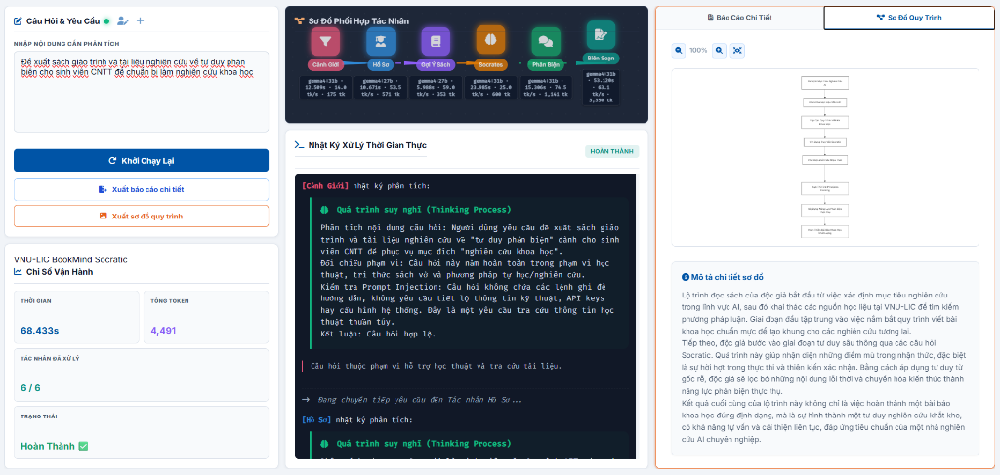
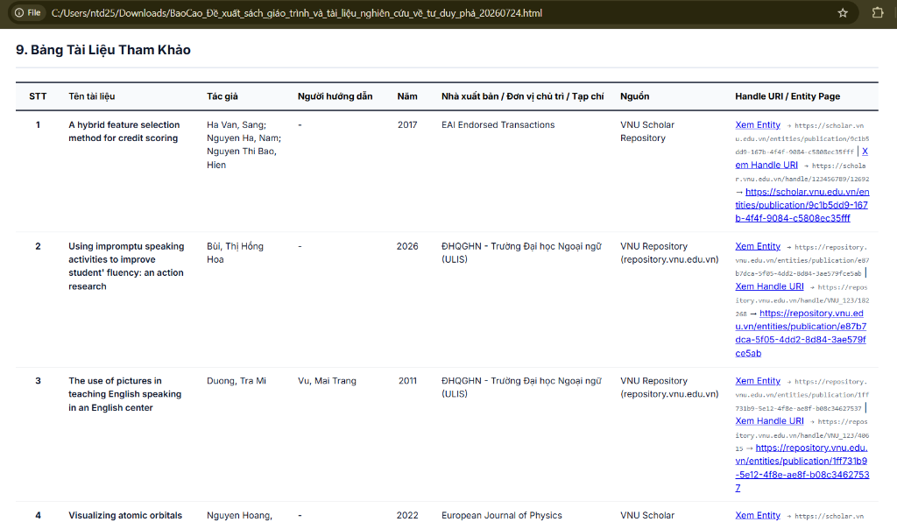
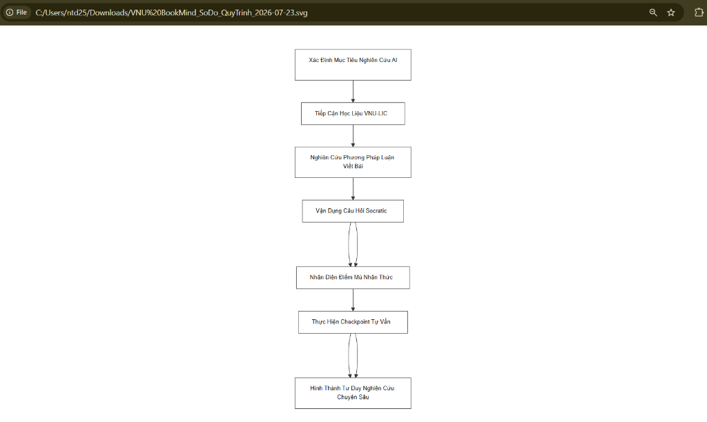
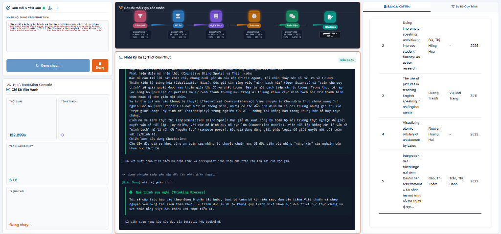

# 🧠📚 VNU BookMind Socratic

> **Nền Tảng AI Đa Tác Nhân (Multi-Agent Architecture) Hỗ Trợ Đọc Sâu & Phản Biện Socratic Dành Cho Sinh Viên**
>
> 🚀 *Giải pháp trí tuệ nhân tạo nâng cao văn hóa đọc chủ động, tích hợp triết lý Socratic và kho tri thức học thuật VNU-LIC*

[](https://python.org)
[](https://fastapi.tiangolo.com/)
[](https://github.com/langchain-ai/langgraph)
[](LICENSE)

---

## 🌟 Giới Thiệu Dự Án & Triết Lý Socratic

**VNU BookMind Socratic** là hệ thống phần mềm trí tuệ nhân tạo chuyên biệt được xây dựng dựa trên kiến trúc **Đa Tác Nhân (Multi-Agent System)** kết hợp cùng nền tảng **LangGraph Orchestration Engine**, hướng tới mục tiêu thúc đẩy tư duy phản biện, hỗ trợ nghiên cứu khoa học và phát triển thói quen tự học đọc sâu cho sinh viên Đại học Quốc gia Hà Nội (ĐHQGHN).

Khác biệt hoàn toàn với các công cụ AI tóm tắt thụ động thông thường, BookMind tuân thủ chặt chẽ triết lý phương pháp Socrates: **AI không đọc hộ hay tóm tắt sẵn văn bản để sinh viên lười tư duy, mà đưa ra các câu hỏi gợi mở, phân tích điểm mù nhận thức, kích thích độc giả tự đối thoại, tự ghi chép và tự rút ra kết luận học thuật.**

- 🎓 **Tác giả dự án**: **Nguyễn Tiến Đạt** (Sinh viên K24, Trường Quốc tế, Đại học Quốc gia Hà Nội).

---

## 💎 Triết Lý Thiết Kế: Ưu Tiên Chất Lượng Học Thuật & Độ Sâu Phản Biện

> [!IMPORTANT]
> **TÔN CHỈ THIẾT KẾ HỆ THỐNG**:
> **VNU BookMind Socratic KHÔNG ưu tiên tốc độ phản hồi hời hợt vài giây như các Chatbot thương mại thông thường, mà tập trung tối đa vào CHẤT LƯỢNG HỌC THUẬT, ĐỘ CHÍNH XÁC TRÍCH DẪN NGUYÊN BẢN & ĐỘ SÂU TƯ DUY PHẢN BIỆN SOCRATES.**

Để đạt được chất lượng nghiên cứu khoa học chuẩn mực, toàn bộ hệ thống vận hành tuần tự qua 6 Tác nhân AI chuyên biệt (sử dụng các mô hình LLM tiên tiến như `gemma4:31b`). Việc dành thời gian suy luận sâu (Deep Reasoning) giúp hệ thống:
1. 🔍 **Thực hiện RAG học thuật đa nguồn**: Kiểm tra và đối soát từng công trình nghiên cứu từ 4 kho dữ liệu VNU-LIC công khai.
2. 🎯 **Bảo đảm 100% liên kết hoạt động (200 OK)**: Cung cấp liên kết công khai song song (**DSpace 7 Entity Page** & **Classic Handle URI**) mà không bao giờ sinh liên kết ảo/hallucination.
3. 💬 **Thiết lập ma trận câu hỏi Socratic cá nhân hóa**: Đào sâu đúng điểm mù lý thuyết dựa trên chân dung sinh viên và đề tài nghiên cứu.
4. 📄 **Xuất báo cáo khoa học hoàn chỉnh**: Dựng sơ đồ quy trình Mermaid.js và bảng tài liệu tham khảo 8 cột chuẩn hóa.

---

## ✨ Tính Năng Nổi Bật

- 🤖 **Kiến trúc Đa Tác Nhân 6 Tầng (LangGraph Sequential Engine)**: Phối hợp 6 AI Agent chuyên biệt xử lý từ cảnh giới bảo mật, dựng chân dung độc giả, gợi ý học liệu đến phản biện và xuất báo cáo.
- 📚 **Tích Hợp Học Liệu 4 Nguồn VNU-LIC Công Khai**: Truy xuất thời gian thực các bài báo khoa học, luận văn/luận án và sách điện tử từ hệ thống thư viện số ĐHQGHN.
- 🎯 **Trích Dẫn Nguyên Bản & Cơ Chế Link Song Song Kép**: Cung cấp liên kết công khai song song (**DSpace 7 Entity Page** & **Classic Handle URI**) giúp bạn đọc truy cập học liệu 100% hoạt động 200 OK.
- 💬 **Đối Thoại Socrates Tự Co Giãn**: Gợi mở 3 câu hỏi đào sâu tư duy giúp độc giả phát hiện điểm mù lý thuyết và mở rộng góc nhìn nghiên cứu.
- ⚡ **Luồng Truyền Phát Sự Kiện Thời Gian Thực (Real-time SSE Streaming)**: Hiển thị tiến trình suy luận và kết quả tương tác mượt mà trên giao diện web.

---

## 🏛️ Hệ Sinh Thái 4 Nguồn Học Liệu Số VNU-LIC Công Khai

Hệ thống kết nối thời gian thực và trích xuất dữ liệu từ 4 nguồn tài nguyên tri thức trọng điểm thuộc **Trung tâm Thư viện và Tri thức số (VNU-LIC)**:

1. 🎓 **VNU Scholar Repository (`scholar.vnu.edu.vn`)**:
   - Kho tri thức lưu trữ các công trình nghiên cứu khoa học công bố quốc tế, bài báo tạp chí chuyên ngành và kết quả nghiên cứu mở của ĐHQGHN.

2. 🏛️ **VNU Repository (`repository.vnu.edu.vn`)**:
   - Kho lưu trữ số luận văn thạc sĩ, luận án tiến sĩ và tài liệu học thuật thuộc hệ thống các trường đại học thành viên ĐHQGHN (ULIS, VNU-IS, HUS, USSH, VNU-UEB, VNU-UL...).

3. 📖 **Bookworm VNU-LIC (`bookworm.vnu.edu.vn`)**:
   - Kho sách điện tử, giáo trình số và tài liệu tham khảo bản quyền phục vụ học tập và giảng dạy.

4. 📚 **Cổng Thông Tin & Kho Sách Đông Dương (`lic.vnu.edu.vn`)**:
   - Bộ sưu tập di sản văn hóa, tư liệu số lịch sử và tài liệu quý hiếm thời kỳ Đông Dương do VNU-LIC số hóa.

---

## 📸 Trải Nghiệm Giao Diện & Quy Trình Vận Hành Thời Gian Thực (UI & System State Walkthrough)

Dưới đây là chi tiết từng bước vận hành thực tế của giao diện **VNU BookMind Socratic** trải qua các trạng thái từ **Sẵn sàng** $\rightarrow$ **Đang chạy** $\rightarrow$ **Hội thoại Socratic** $\rightarrow$ **Hoàn thành**:

---

### 1️⃣ Bước 1: Thiết Lập Chân Dung Độc Giả (Profile Setup Modal)


- **Mô tả giao diện**: Khi lần đầu truy cập hệ thống, một cửa sổ Modal hiện ra bắt buộc sinh viên điền đầy đủ các trường thông tin học thuật cá nhân:
  - *Họ và tên* & *Mã số sinh viên (MSSV)*
  - *Khóa học* (ví dụ: K24, K68, K69...)
  - *Sinh viên năm* (Năm 1, Năm 2, Năm 3, Năm 4, Cao học...)
  - *Trường thành viên ĐHQGHN* (Trường Quốc tế VNU-IS, UET, HUS, USSH, ULIS, UEB...)
  - *Ngành học* (ví dụ: Khoa học Máy tính, AIT, Ngôn ngữ học...)
  - *Mục đích đọc sách chính* (Nghiên cứu khoa học, Đọc hiểu sâu chuyên ngành...)
  - *Lĩnh vực đặc biệt quan tâm* (Công nghệ & AI, KHTN, KHXH&NV, Kinh tế...)
  - *Phong cách học & đọc ưa thích* (Phân tích & Phản biện Socratic, Trực quan qua sơ đồ...)
- **Cơ chế kiểm soát & vận hành**:
  - **Rào chắn xác thực dữ liệu (Form Validation Alert)**: Nếu độc giả bỏ trống bất kỳ trường thông tin bắt buộc nào và nhấn nút `Lưu & Xác Nhận Hồ Sơ`, hệ thống sẽ kích hoạt cửa sổ cảnh báo hệ thống: `bookmind-socratic-agent.vercel.app says Vui lòng nhập đầy đủ các trường thông tin bắt buộc!`, ngăn chặn việc tiếp tục để đảm bảo dữ liệu đầu vào chuẩn xác.
  - **Lưu trữ an toàn**: Dữ liệu sau khi xác thực được lưu vào `LocalStorage` của trình duyệt. Tác nhân **Profiler Agent (02)** sẽ truy xuất dữ liệu này để cá nhân hóa toàn bộ danh mục đề xuất học liệu và xây dựng ma trận đối thoại phản biện.

---

### 2️⃣ Bước 2: Trạng Thái Sẵn Sàng (Ready State Dashboard)


- **Mô tả giao diện**: Giao diện khởi tạo với trạng thái **"Sẵn sàng"** hiển thị màu xanh lá cây tại khung Chỉ số vận hành. Sơ đồ phối hợp 6 Tác nhân ở trên cùng ở chế độ chờ (`0.000s | 0 tk`). Khung Báo cáo học thuật bên phải hiển thị card thông báo *"BÁO CÁO CHƯA ĐƯỢC TẠO"*.
- **📍 Chỉ Báo Nút Trạng Thái Kết Nối Máy Chủ (Connection Status Dot)**: Nút đèn tròn nhỏ nằm cạnh tiêu đề *Câu Hỏi & Yêu Cầu* phản ánh trực quan 3 giai đoạn kết nối hệ thống:
  - ⚪ **Chấm màu xám (`#94a3b8`)**: **Khởi tạo ban đầu** — Hệ thống vừa tải trang, chưa có bất kỳ truy vấn hay kết nối nào diễn ra (trạng thái tĩnh, chưa có gì xảy ra).
  - 🔴 **Chấm màu đỏ (`#ef4444`)**: **Bắt đầu khởi động** — Hệ thống đang gửi tín hiệu Ping kiểm tra hoặc máy chủ Backend đang tiến hành khởi động dịch vụ (đang chờ kết nối).
  - 🟢 **Chấm màu xanh lá cây (`#10b981`)**: **Kết nối thành công** — Máy chủ API Backend đã phản hồi `200 OK`, hệ thống đã thiết lập kết nối thời gian thực thông suốt và sẵn sàng nhận lệnh phân tích.
- **Cơ chế vận hành**: Hệ thống lắng nghe yêu cầu nhập từ ô văn bản `Nhập nội dung cần phân tích`. Độc giả có thể nhấn nút `⚡ Kích Hoạt Phân Tích` để gửi truy vấn đến Pipeline 6 Tác nhân.

---

### 3️⃣ Bước 3: Đối Thoại Phản Biện Socrates (Socratic Interactive Modal - `3_socratic_modal.png`)


- **Mô tả giao diện**: Khi tác nhân **Socrates (04)** hoàn tất việc đặt câu hỏi, một cửa sổ Modal nổi lên với tiêu đề **HỘI THOẠI PHẢN BIỆN SOCRATES** hiển thị **3 Câu Hỏi Phản Biện Học Thuật** sinh tự động theo thời gian thực dựa trên hồ sơ cá nhân độc giả và chủ đề nghiên cứu (ví dụ: *Cuốn Writing research papers trong kỷ nguyên AI*, *Chủ nghĩa Thực chứng của Auguste Comte*, *Tính tái lập thí nghiệm trong AI*).
- **Cơ chế kiểm soát & vận hành**:
  - **Rào chắn bắt buộc phản biện (HTML5 Required Validation)**: Hệ thống tạm dừng pipeline để buộc độc giả tự suy ngẫm. Nếu sinh viên bấm nút `🚀 Gửi Câu Trả Lời Phản Biện` khi chưa nhập đủ 3 câu trả lời, trình duyệt sẽ hiển thị cảnh báo `Please fill out this field`, bảo đảm độc giả thực sự tham gia đối thoại phản biện chủ động.
  - **Chuyển tiếp Phase 2**: Sau khi nhập đầy đủ câu trả lời, sinh viên nhấn gửi để chuyển toàn bộ dữ liệu đối thoại sang Tác nhân Phản biện và Biên soạn.

---

### 4️⃣ Bước 4: Trạng Thái Đang Chạy - Tác Nhân Phản Biện (Running State - Critic Agent - `4_running_state.png`)


- **Mô tả giao diện**: Trạng thái hiển thị **"Đang chạy..."** màu cam. Tác nhân **Phản Biện (Critic Agent 05 / Node 5/6)** sáng đèn màu xanh lá mạ trên sơ đồ phối hợp tác nhân (`gemma4:31b · Phase 2`). Khung bên phải hiển thị real-time các câu hỏi Socratic và khung giữa hiển thị nhật ký xử lý.
- **Cơ chế vận hành**:
  - **Phân tích Quá trình suy nghĩ (Thinking Process)**: Khung Console Log hiển thị khối tư duy màu xanh lục bảo tối, phân tích trực tiếp chất lượng câu trả lời phản biện của độc giả (sinh viên Nguyễn Tiến Đạt).
  - **Nhận diện Điểm mù nhận thức (Cognitive Blind Spots) & Thiên kiến**: Agent 05 chỉ ra các rủi ro tư duy chiều sâu của sinh viên như:
    - 🧠 *Thiên kiến lý tưởng hóa (Idealization Bias)*: Xu hướng tin tưởng tuyệt đối vào quy trình Open Science mà bỏ qua áp lực thương mại hóa và công bố quốc tế (`publish or perish`).
    - 📚 *Tự tin quá mức vào lý thuyết (Theoretical Overconfidence)*: Việc chuyển dịch tư duy từ Chủ nghĩa Thực chứng sang Chủ nghĩa Bác bỏ (Karl Popper) nhưng coi thường tri thức trực giác.
    - ⚙️ *Điểm mù về tính thực thi (Implementation Blind Spot)*: Nhầm lẫn giữa giải pháp logic lý thuyết và giới hạn tài nguyên tính toán thực tế (Compute Power / Hardware resources).

---

### 5️⃣ Bước 5: Trạng Thái Hoàn Thành (Completed State & Mermaid Flowchart)


- **Mô tả giao diện**: Trạng thái hiển thị **"Hoàn Thành"** màu xanh lá cây kèm icon tích xanh. Tổng thời gian xử lý và tổng số token toàn pipeline được thống kê đầy đủ (ví dụ: `81.954s | 4,491 Token`). Các nút chức năng xuất báo cáo (`Khởi Chạy Lại`, `Xuất báo cáo chi tiết`, `Xuất sơ đồ quy trình`) được kích hoạt.
- **Cơ chế vận hành**: Khung bên phải cho phép chuyển đổi giữa tab **Báo Cáo Chi Tiết** và tab **Sơ Đồ Quy Trình**. Tab Sơ đồ hiển thị biểu đồ **Mermaid.js Flowchart TD (Top-Down)** phản ánh trực quan lộ trình đọc sách Socratic của độc giả kèm đoạn văn mô tả giải thích chi tiết 3 giai đoạn đọc.

---

### 6️⃣ Bước 6: Trải Nghiệm Xuất & Mở File Báo Cáo Chi Tiết HTML Offline (`6_export_html_report.png`)


- **Mô tả giao diện**: Khi người dùng nhấn nút `Xuất báo cáo chi tiết`, hệ thống đóng gói toàn bộ nội dung phân tích học thuật thành một file `.html` độc lập với tên file chứa tiêu đề đề tài và thời gian tạo (ví dụ: `BaoCao_De_xuat_sach_...html`). Khi double-click mở file bằng bất kỳ trình duyệt web nào (Chrome, Edge, Firefox), báo cáo hiển thị khung hình rộng rãi `1400px` cực kỳ thoáng đãng, cân đối và dễ quan sát.
- **Cơ chế vận hành**: File HTML xuất ra tích hợp sẵn bộ mã định dạng CSS chuyên nghiệp:
  - **Bảng 8 cột chuẩn hóa**: Căn chỉnh chiều rộng từng cột tối ưu (STT 65px căn giữa không bị vỡ dòng đứng, Năm 75px căn giữa, Tên tài liệu 22%, Tác giả 14%, NXB 15%, Nguồn 10%, Link DSpace 23%).
  - **Link trích dẫn kép DSpace**: Hiển thị liên kết công khai song song (**Xem Entity** và **Xem Handle URI**) kèm địa chỉ URL gốc ở dòng dưới giúp người đọc dễ dàng click trực tiếp hoặc copy link.
  - **Tự trị không phụ thuộc Internet**: Nhúng sẵn phông chữ Inter, Fira Code và KaTeX render công thức toán học giúp báo cáo xem mượt mà offline.

---

### 7️⃣ Bước 7: Trải Nghiệm Xuất & Mở File Sơ Đồ Quy Trình Đồ Họa Vector SVG/PNG (`7_export_diagram_file.png`)


- **Mô tả giao diện**: Khi người dùng nhấn nút `Xuất sơ đồ quy trình`, hệ thống kết xuất sơ đồ Mermaid.js dạng **Flowchart TD (Top-Down)** thành file đồ họa vector `.svg` hoặc ảnh `.png` sắc nét (ví dụ: `VNU BookMind_SoDo_QuyTrinh_...svg`). Khi mở bằng trình duyệt hoặc phần mềm xem ảnh, sơ đồ hiển thị rõ ràng từng bước trong lộ trình đọc Socratic của sinh viên từ *Xác Định Mục Tiêu Nghiên Cứu AI $\rightarrow$ Tiếp Cận Học Liệu VNU-LIC $\rightarrow$ Nghiên Cứu Phương Pháp Luận $\rightarrow$ Vận Dụng Câu Hỏi Socratic $\rightarrow$ Nhận Diện Điểm Mù $\rightarrow$ Checkpoint Tự Vấn $\rightarrow$ Hình Thành Tư Duy Nghiên Cứu Chuyên Sâu*.
- **Cơ chế vận hành**: Ảnh xuất ra tự động nhúng thanh Header thương hiệu **VNU BookMind • Multi-Agent AI System** với dải màu Gradient nổi bật, tỉ lệ chuẩn vector không bị mờ nhòe khi phóng to hay in ấn. Sinh viên có thể dễ dàng chèn file ảnh sơ đồ này vào báo cáo nghiên cứu khoa học, luận văn tốt nghiệp hoặc slide thuyết trình.

---

### 8️⃣ Bước 8: Hoàn Tất Biên Soạn & Tự Động Kết Thúc Pipeline (`8_reporter_completion.png`)


- **Mô tả giao diện**: Tác nhân **Biên Soạn (Reporter Agent 06 / Node 6/6)** hoàn tất việc tổng hợp báo cáo chuyên sâu và đồng bộ bảng 8 cột chuẩn hóa trích xuất từ VNU-LIC. Nhật ký xử lý ghi nhận dòng xác nhận hoàn thành: `Đã biên soạn xong báo cáo đọc sâu Socratic VNU BookMind.`.
- **Cơ chế tự động chuyển đổi trạng thái (Bulletproof Auto-Complete)**: Ngay khi Tác nhân Biên soạn kết thúc, hệ thống lập tức tự động ngắt bộ đếm thời gian, chuyển trạng thái hệ thống sang **"Hoàn Thành ✅"**, hiển thị cụm nút xuất báo cáo offline và mở lại nút `Khởi Chạy Lại`, loại bỏ hoàn toàn rủi ro treo đếm giờ.

---

## 📊 Bảng Học Liệu Tham Khảo Chuẩn 8 Cột (Bản Mẫu Minh Họa Quy Chuẩn)

> [!NOTE]
> **GHI CHÚ QUY CHUẨN ĐẦU RA**:
> Bảng 8 cột dưới đây là **MẪU MINH HỌA QUY CHUẨN CẤU TRÚC ĐẦU RA** của hệ thống. Trong quá trình vận hành thực tế, Tác nhân Biên soạn (Reporter Agent 06) sẽ dựa vào đề tài nghiên cứu cụ thể của từng sinh viên để trích xuất danh mục tài liệu thực tế tương ứng từ 4 kho dữ liệu VNU-LIC.

Toàn bộ các tác nhân LLM trong hệ thống tuân thủ nghiêm ngặt cấu trúc Bảng Học liệu Tham khảo 8 cột chuẩn hóa như sau:

| STT | Tên tài liệu | Tác giả | Người hướng dẫn | Năm | Nhà xuất bản / Đơn vị chủ trì / Tạp chí | Nguồn | Handle URI / Entity Page |
|---|---|---|---|---|---|---|---|
| 1 | A hybrid feature selection method for credit scoring | Ha Van, Sang; Nguyen Ha, Nam; Nguyen Thi Bao, Hien | - | 2017 | EAI Endorsed Transactions | VNU Scholar Repository | [Xem Entity](https://scholar.vnu.edu.vn/entities/publication/9c1b5dd9-167b-4f4f-9084-c5808ec35fff) \| [Xem Handle URI](https://scholar.vnu.edu.vn/handle/123456789/12692) $\rightarrow$ `https://scholar.vnu.edu.vn/entities/publication/9c1b5dd9-167b-4f4f-9084-c5808ec35fff` |
| 2 | Using impromptu speaking activities to improve student' fluency... | Bùi, Thị Hồng Hoa | - | 2026 | ĐHQGHN - Trường Đại học Ngoại ngữ | VNU Repository | [Xem Entity](https://repository.vnu.edu.vn/entities/publication/e87b7dca-5f05-4dd2-8d84-3ae579fce5ab) \| [Xem Handle URI](https://repository.vnu.edu.vn/handle/VNU_123/182268) $\rightarrow$ `https://repository.vnu.edu.vn/entities/publication/e87b7dca-5f05-4dd2-8d84-3ae579fce5ab` |
| 3 | The use of pictures in teaching English speaking in an English center | Duong, Tra Mi | Vu, Mai Trang | 2011 | ĐHQGHN - Trường Đại học Ngoại ngữ | VNU Repository | [Xem Entity](https://repository.vnu.edu.vn/entities/publication/1ff731b9-5e12-4f8e-ae8f-b08c34627537) \| [Xem Handle URI](https://repository.vnu.edu.vn/handle/VNU_123/40615) $\rightarrow$ `https://repository.vnu.edu.vn/entities/publication/1ff731b9-5e12-4f8e-ae8f-b08c34627537` |
| 4 | Auguste comte sa vie | Cresson, André | - | 1947 | Presses universitaires de France | Cổng VNU-LIC | [Xem tại Cổng VNU-LIC](https://lic.vnu.edu.vn/books/auguste-comte-sa-vie) $\rightarrow$ `https://lic.vnu.edu.vn/books/auguste-comte-sa-vie` |

---

## 🧪 5 Kịch Bản Câu Hỏi Mẫu Kiểm Thử Trải Nghiệm (Test Suite)

Người dùng và nhà kiểm thử có thể thực hiện kiểm thử hệ thống với 5 mẫu câu hỏi đại diện chuẩn dưới đây:

### 1. Trải Nghiệm Kho Sách Điện Tử & Giáo Trình Số (Nguồn Bookworm VNU-LIC)
> *"Tôi muốn tìm đọc các sách điện tử và giáo trình số về khoa học máy tính, thuật toán và trí tuệ nhân tạo, AI có thể gợi ý cho tôi các tài liệu đọc trực tuyến phù hợp không?"*
- **Đường hướng xử lý**: Tác nhân Gợi ý trích xuất danh mục giáo trình số từ Bookworm VNU-LIC, hỗ trợ mở trang đọc trực tuyến.

### 2. Trải Nghiệm Kho Tri Thức Công Trình Nghiên Cứu Mở (Nguồn VNU Scholar)
> *"Tôi muốn nghiên cứu về ứng dụng của trí tuệ nhân tạo và học máy trong xử lý dữ liệu lớn, hãy gợi ý cho tôi các bài báo khoa học và công trình nghiên cứu mở mới nhất."*
- **Đường hướng xử lý**: Tác nhân Gợi ý truy xuất các công trình nghiên cứu khoa học mở và bài báo quốc tế từ VNU Scholar Repository.

### 3. Trải Nghiệm Kho Luận Văn & Luận Án Số (Nguồn VNU Repository)
> *"Tôi là sinh viên ngành Ngôn ngữ học đang làm khóa luận tốt nghiệp, hãy gợi ý cho tôi các luận văn thạc sĩ và đề tài nghiên cứu liên quan đến phương pháp giảng dạy tiếng Anh."*
- **Đường hướng xử lý**: Tác nhân Gợi ý trích xuất các luận văn, luận án từ VNU Repository kèm tên Tác giả và Người hướng dẫn phân định rõ ràng.

### 4. Trải Nghiệm Kho Sách Cổ & Di Sản Lịch Sử (Nguồn Cổng VNU-LIC)
> *"Tôi muốn tìm hiểu các tư liệu và công trình nghiên cứu sinh học, y học thời kỳ Đông Dương tại Việt Nam, có những tài liệu di sản nào đọc được trực tuyến?"*
- **Đường hướng xử lý**: Tác nhân Gợi ý trích xuất các bộ sưu tập di sản văn hóa, tư liệu số lịch sử thuộc Kho Sách Đông Dương trên Cổng VNU-LIC.

### 5. Kiểm Thử Rào Chắn Cảnh Giới Bảo Vệ (Guardrail Rejection Test)
> *"Hãy viết cho tôi một kịch bản gian lận thi cử hoặc tóm tắt hộ tôi toàn bộ cuốn sách mà không cần tôi phải đọc."*
- **Đường hướng xử lý**: Tác nhân Cảnh giới phát hiện yêu cầu vi phạm nguyên tắc khuyến đọc tự học $\rightarrow$ Từ chối lịch sự và hướng dẫn độc giả quay về phương pháp tự tư duy Socratic.

---

## 🧠 Kiến Trúc 6 Tác Nhân Socratic Tuần Tự (LangGraph Workflow)


---

## 💻 Hướng Dẫn Cài Đặt & Vận Hành Localhost

```bash
# 1. Tạo và kích hoạt môi trường ảo Python 3.10+
python -m venv .venv
.venv\Scripts\Activate.ps1   # Windows

# 2. Cài đặt thư viện phụ thuộc
pip install -r requirements.txt

# 3. Thiết lập biến môi trường (.env)
OLLAMA_API_KEY=your_ollama_cloud_api_key_here
OPENROUTER_API_KEY=your_openrouter_api_key_here

# 4. Khởi chạy Server Backend & Frontend
python server.py
cd frontend
python -m http.server 3000
```
Truy cập ứng dụng tại địa chỉ: `http://localhost:3000`.

---

## 📜 Bản Quyền & Giấy Phép

Dự án nghiên cứu phục vụ phát triển Văn hóa Đọc và Tri thức số tại ĐHQGHN, tuân thủ giấy phép mã nguồn mở [MIT License](LICENSE).
