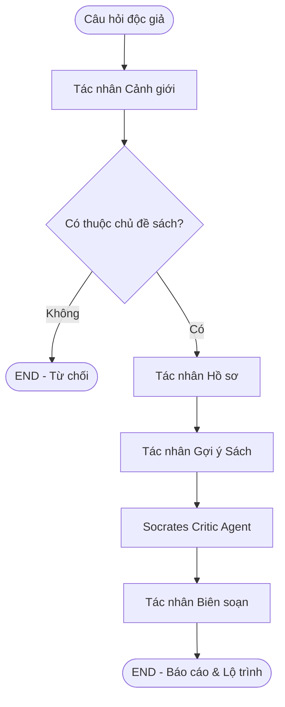

# VNU BookMind Socratic — Trợ lý Độc lập & Phản biện Sách Socratic Đa tác nhân

Giải pháp hỗ trợ đọc sâu, tự học và phản biện học thuật cho sinh viên Đại học Quốc gia Hà Nội (ĐHQGHN) sử dụng kiến trúc đồ thị trạng thái LangGraph kết hợp Koha ILS API của Trung tâm Thư viện và Tri thức số (VNU-LIC).

## 🧠 Kiến trúc 4 Tác tử Socratic (Socratic Reading Pipeline)
Hệ thống sử dụng mô hình 4 tác tử chuyên biệt, loại bỏ hoàn toàn cơ chế "tóm tắt hộ" của AI truyền thống, buộc người đọc phải chủ động tư duy:



1.  **Cảnh Giới (Guardrail Agent):** Xác thực câu hỏi, từ chối các câu hỏi ngoài phạm vi sách vở và học liệu.
2.  **Hồ Sơ (Profiler Agent):** Phân tích ngành học dự kiến và nhu cầu tư duy để cá nhân hóa đề xuất đọc.
3.  **Gợi Ý Sách (Recommender Agent):** Tra cứu Koha API của VNU-LIC để tìm kiếm sách thật, vị trí kệ sách và đề xuất danh mục đọc phù hợp.
4.  **Socrates (Socrates Critic Agent):** Đưa ra 3 câu hỏi phản biện mở dựa trên triết lý Socratic. Tuyệt đối không tóm tắt, bắt độc giả tự phản biện và ghi nhật ký đọc sâu.
5.  **Biên Soạn (Reporter Agent):** Tổng hợp báo cáo đọc sách Markdown, vẽ sơ đồ Mermaid lộ trình đọc chủ động.

## 🛠️ Cài đặt & Vận hành
### 1. Cấu hình biến môi trường
Tạo tệp `.env` tại thư mục gốc:
```env
OLLAMA_API_KEY=your_openrouter_api_key
OLLAMA_BASE_URL=https://openrouter.ai/api/v1
```

### 2. Cài đặt và Chạy Backend FastAPI
```bash
python -m venv .venv
.venv\Scripts\activate
pip install -r requirements.txt
python main.py --server
```

### 3. Chạy Frontend Vercel
Giao diện tĩnh đã được triển khai trực tiếp tại Vercel. Bạn có thể mở mã nguồn thư mục `bookmind-socratic-agent-frontend/` và khởi chạy cục bộ nếu cần:
```bash
npx serve bookmind-socratic-agent-frontend
```
