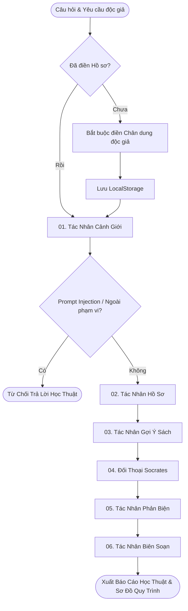

# VNU BookMind Socratic 🧠📚

> **Nền Tảng Đa Tác Nhân (Multi-Agent Architecture) Hỗ Trợ Đọc Sâu & Phản Biện Socratic Dành Cho Sinh Viên**
>
> 🚀 *Giải pháp trí tuệ nhân tạo nâng cao văn hóa đọc chủ động, tích hợp triết lý Socratic và kho tri thức học thuật VNU-LIC*

[](https://python.org)
[](https://fastapi.tiangolo.com/)
[](https://github.com/langchain-ai/langgraph)
[](LICENSE)

---

## 🌟 Giới Thiệu Dự Án & Triết Lý Socratic

**VNU BookMind Socratic** là hệ thống phần mềm trí tuệ nhân tạo chuyên biệt được xây dựng dựa trên kiến trúc Đa Tác Nhân (Multi-Agent System), hướng tới mục tiêu thúc đẩy tư duy phản biện, hỗ trợ nghiên cứu khoa học và phát triển thói quen tự học đọc sâu cho sinh viên Đại học Quốc gia Hà Nội (ĐHQGHN).

Khác biệt với các công cụ AI tóm tắt thụ động, BookMind tuân thủ chặt chẽ triết lý phương pháp Socrates: **AI không đọc hộ hay tóm tắt sẵn văn bản, mà đưa ra các câu hỏi gợi mở, phân tích điểm mù nhận thức và khuyến khích độc giả tự đối thoại, tự ghi chép và đưa ra kết luận.**

---

## 🏛️ Danh Mục & Quy Chuẩn Phân Loại 5 Nguồn Học Liệu Số VNU-LIC

Hệ thống kết nối thời gian thực và trích xuất dữ liệu từ 5 nguồn tài nguyên tri thức trọng điểm thuộc **Trung tâm Thư viện và Tri thức số (VNU-LIC)**:

### 🌐 Nguồn Mở Truy Cập Trực Tiếp (Public Access Resources)

1. **Bookworm VNU-LIC (`bookworm.vnu.edu.vn`)**:
   - **Mô tả**: Kho sách điện tử, giáo trình số và tài liệu tham khảo bản quyền. Cho phép bạn đọc tra cứu và đọc trực tiếp trên trình duyệt hoặc ứng dụng VNU-LIC.
   - **Mẫu liên kết**: `https://bookworm.vnu.edu.vn/EDetail.aspx?id={id}`

2. **VNU Scholar Repository (`scholar.vnu.edu.vn`)**:
   - **Mô tả**: Nền tảng quản trị tri thức số lưu trữ bài báo khoa học, công trình nghiên cứu công bố quốc tế, luận án tiến sĩ và kết quả nghiên cứu khoa học mở của ĐHQGHN.
   - **Mẫu liên kết**: `https://scholar.vnu.edu.vn/entities/publication/{uuid}`

3. **Cổng Thông Tin & Kho Sách Đông Dương (`lic.vnu.edu.vn`)**:
   - **Mô tả**: Bộ sưu tập di sản văn hóa, tư liệu số lịch sử và tài liệu quý hiếm thời kỳ Đông Dương do VNU-LIC số hóa.
   - **Mẫu liên kết**: `https://lic.vnu.edu.vn/books/{slug}`

---

### 🔒 Nguồn Tra Cứu Mạng Nội Bộ (VNU Campus Network Resources)

4. **Koha OPAC Catalog (`opac.vnu.edu.vn`)**:
   - **Mô tả**: Hệ thống quản trị thư viện tích hợp, hỗ trợ tra cứu thư mục, vị trí xếp giá và thông tin mã tài liệu in. Truy cập trực tiếp yêu cầu kết nối mạng nội bộ ĐHQGHN (VNU Campus Network / VNU VPN).

5. **DSpace VNU Repository (`repository.vnu.edu.vn`)**:
   - **Mô tả**: Kho tài nguyên lưu trữ số nội bộ chuyên quản lý luận văn, luận án và tài liệu học thuật định danh. Truy cập trực tiếp yêu cầu kết nối mạng nội bộ ĐHQGHN (VNU Campus Network / VNU VPN).

---

## 🧠 Kiến Trúc 6 Tác Nhân Socratic Tuần Tự (LangGraph Engine)

Hệ thống vận hành dựa trên đồ thị luồng công việc 6 tác nhân chuyên biệt, phối hợp tuần tự để đảm bảo độ chính xác và chiều sâu tri thức:



### Nhiệm Vụ Chi Tiết Từng Tác Nhân:

1. **01. Cảnh Giới (Guardrail Agent)**:
   - Xác thực tính hợp lệ của chủ đề nghiên cứu.
   - Thường trực bảo mật: Chặn đứng Prompt Injection, bảo vệ cấu hình thuật toán và thông tin truy cập hệ thống.

2. **02. Hồ Sơ (Profiler Agent)**:
   - Phân tích thông tin cá nhân hóa của độc giả (Trường thành viên, Ngành học, Mục tiêu đọc, Phong cách nhận thức) để dựng chân dung nghiên cứu.

3. **03. Gợi Ý Sách (Recommender Agent)**:
   - Tìm kiếm song song từ các cơ sở dữ liệu VNU-LIC kết hợp chỉ mục tri thức nội bộ. Đề xuất danh mục tài liệu phù hợp nhất kèm thông tin trích dẫn nguyên bản.

4. **04. Đối Thoại Socrates (Socrates Questioner)**:
   - Xây dựng 3 câu hỏi đối thoại gợi mở sâu sắc, thúc đẩy độc giả tự phân tích thay vì tiếp nhận thông tin một chiều.

5. **05. Phản Biện (Critic Agent)**:
   - Đánh giá góc nhìn đối lập, phát hiện thiên kiến xác nhận (Confirmation Bias) và chỉ ra các điểm mù lý thuyết.

6. **06. Biên Soạn (Reporter Agent)**:
   - Tổng hợp toàn bộ kết quả thành Báo cáo học thuật Markdown hoàn chỉnh, bảng tham khảo chuẩn, sơ đồ lộ trình Mermaid và công thức KaTeX.

---

## ⚡ Động Cơ LLM Động & Cơ Chế Dự Phòng (Auto-Fallback Engine)

- **Tự động chuyển đổi mô hình**: Ưu tiên mô hình tốc độ cao và suy luận sâu trên Ollama Cloud API Key (`gemma4:31b`, `nemotron-3-nano:30b`).
- **Xử lý sự cố linh hoạt**: Tự động chuyển hướng sang chuỗi mô hình dự phòng OpenRouter nếu phát sinh sự cố hạn ngạch (Rate Limit), đảm bảo tiến trình nghiên cứu không bị ngắt quãng.

---

## 💻 Hướng Dẫn Cài Đặt & Vận Hành Localhost

### 1. Khởi tạo môi trường
```bash
# Tạo và kích hoạt môi trường ảo Python 3.10+
python -m venv .venv
.venv\Scripts\Activate.ps1   # Windows PowerShell
# source .venv/bin/activate  # macOS/Linux

# Cài đặt thư viện phụ thuộc
pip install -r requirements.txt
```

### 2. Thiết lập cấu hình biến môi trường (`.env`)
```env
OLLAMA_API_KEY=your_ollama_cloud_api_key_here
OLLAMA_BASE_URL=https://ollama.com/v1
OPENROUTER_API_KEY=your_openrouter_api_key_here
OPENROUTER_BASE_URL=https://openrouter.ai/api/v1
```

### 3. Khởi chạy Server Backend & Frontend
```bash
# Khởi chạy Backend API Server
python server.py

# Khởi chạy Frontend Web App
cd frontend
python -m http.server 3000
```
Truy cập ứng dụng tại địa chỉ: `http://localhost:3000`.

---

## 🌐 Triển Khai Đám Mây & Tự Động Hóa (CI/CD)

- Hệ thống được cấu hình tự động đồng bộ xây dựng và triển khai từ nhánh `main` trên GitHub.
- **Tầng Giao Diện (Frontend)**: Triển khai trên hạ tầng Web tĩnh hiệu năng cao.
- **Tầng Xử Lý (Backend)**: Dịch vụ FastAPI xử lý đa tác nhân và phát dòng sự kiện SSE thời gian thực.

---

## 📜 Bản Quyền & Giấy Phép

Dự án nghiên cứu phục vụ phát triển Văn hóa Đọc và Tri thức số tại ĐHQGHN, tuân thủ giấy phép mã nguồn mở [MIT License](LICENSE).
