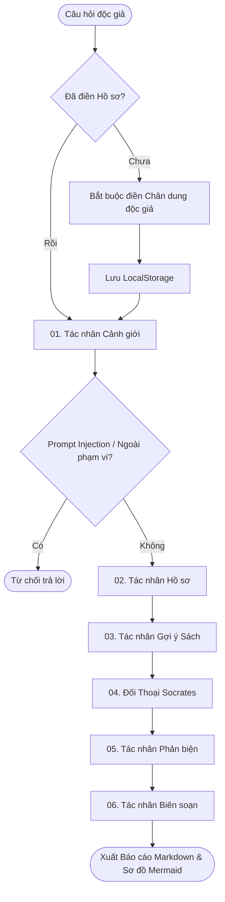

# VNU BookMind Socratic 🧠📚
> **Hệ thống Đa tác nhân (Multi-Agent) Hỗ trợ Đọc sâu & Phản biện Sách Socratic dành cho Sinh viên ĐHQGHN**
> *Bài dự thi giành giải cao nhất cuộc thi Đại sứ Văn hóa Đọc 2026 - Phát triển bởi sinh viên Nguyễn Tiến Đạt (MSV: 24070342 - K24 AIT - Trường Quốc tế - ĐHQGHN).*

[](https://render.com/deploy?repo=https://github.com/ntd25022006q/bookmind-socratic-agent)
[](https://bookmind-socratic-agent.vercel.app/)

---

## 🌟 Giới thiệu Dự án
**VNU BookMind Socratic** là một nền tảng Web thông minh dựa trên AI-Agent được thiết kế nhằm nâng cao văn hóa đọc chủ động, khuyến khích tự học và thúc đẩy tư duy phản biện cho sinh viên. Khác biệt hoàn toàn với các chatbot AI thông thường (thường tóm tắt hộ làm thui chột khả năng tự đọc), BookMind áp dụng triết lý Socrates: **AI không đọc hộ con người, AI định hướng và đặt câu hỏi mở để con người tự phản biện và tự ghi chép đọc sâu.**

Hệ thống kết nối thời gian thực đến các nguồn học liệu chính thống của **Trung tâm Thư viện và Tri thức số (VNU-LIC)** thông qua Koha OPAC API, DSpace API, Bookworm API kết hợp cơ chế tìm kiếm RAG (Retrieval-Augmented Generation) để đưa ra các gợi ý sách và luận văn có thật 100%, nói không với việc LLM bịa đặt link.

---

## 🧠 Kiến trúc Đồ thị 6 Tác nhân Socratic (LangGraph Pipeline)
BookMind Socratic vận hành dựa trên kiến trúc Multi-Agent phối hợp tuần tự thông qua **LangGraph** nhằm chia nhỏ nhiệm vụ, tối ưu hóa ngữ cảnh và nâng cao độ chính xác:



### Chi tiết nhiệm vụ từng tác nhân:
1.  **Cảnh Giới (Guardrail Agent):** 
    *   Lọc và xác thực tính học thuật của yêu cầu.
    *   **Chống Prompt Injection:** Nhận diện và ngăn chặn các nỗ lực xâm nhập dò hỏi system prompt, API keys, tokens bảo mật của Vercel/Render, từ chối thẳng thắn các câu hỏi ngoài phạm vi khuyến đọc (thời tiết, chính trị thời sự...).
2.  **Hồ Sơ (Profiler Agent):** 
    *   Phân tích thông tin hồ sơ độc giả đăng ký (Họ tên, MSSV, Ngành học) kết hợp với chủ đề để tạo dựng chân dung độc giả cá nhân hóa.
3.  **Gợi Ý Sách (Recommender Agent):** 
    *   Gọi trực tiếp Koha RSS API (sách giấy), DSpace REST API (luận án) và Bookworm API (eBook) của VNU-LIC kết hợp RAG để đề xuất 3 tài liệu chính xác có thật kèm link đọc.
4.  **Đối Thoại Socrates (Socrates Questioner):** 
    *   **Nguyên tắc Không tóm tắt hộ:** Từ chối tóm tắt sách hộ người dùng. Thay vào đó, đặt ra 3 câu hỏi đối thoại mở Socrates sâu sắc kích thích tự vấn.
5.  **Phản Biện (Critic Agent):** 
    *   Phát hiện thiên kiến xác nhận, phân tích điểm mù nhận thức khi độc giả tiếp cận chủ đề.
6.  **Biên Soạn (Reporter Agent):** 
    *   Tổng hợp toàn bộ quy trình thành Báo cáo học thuật Markdown hoàn chỉnh (không `**`, không chữ Hán/Nhật/Hàn), bảng tài liệu tham khảo 6 cột chuẩn, sơ đồ lộ trình đọc Mermaid và tích hợp **KaTeX** hiển thị công thức toán học/khoa học.

---

## 🛠️ Tính năng Đột phá Mới Cập nhật
-   **Form Thiết lập Chân dung Độc giả:** Bắt buộc điền thông tin khi mở web lần đầu (lưu LocalStorage). Khi người dùng gửi câu hỏi, profile động này được gửi lên backend để cá nhân hóa đề xuất.
-   **Tích hợp API Thư viện VNU-LIC thật:** Kết nối và parse XML Dublin Core tự động của Koha OPAC, DSpace API, Bookworm API và ChromaDB RAG.
-   **Cấu hình Ollama Cloud Xịn Sò:** Trỏ trực tiếp đến Ollama Cloud (`https://ollama.com/v1`) của tác giả, chạy các model suy luận sâu cực mạnh: **`deepseek-v4-pro`** (Reasoning deep-steps) và **`deepseek-v4-flash`** (High-speed routing).

---

## 💻 Hướng dẫn Cài đặt & Chạy Local

### 1. Cấu hình biến môi trường
Tạo tệp `.env` tại thư mục gốc dự án:
```env
OLLAMA_API_KEY=62784be9ab144786bcdc97cf87148957.Scby0xkLy0ej0vHZeTa3lOOW
OLLAMA_BASE_URL=https://ollama.com/v1
```

### 2. Khởi chạy Backend (FastAPI)
Yêu cầu Python 3.9 trở lên.
```bash
# Tạo môi trường ảo
python -m venv .venv
source .venv/bin/activate  # Trên Windows: .venv\Scripts\activate

# Cài đặt thư viện
pip install -r requirements.txt

# Khởi chạy server API
python server.py
```
Backend sẽ khởi chạy tại cổng mặc định `http://127.0.0.1:8000`.

### 3. Khởi chạy Frontend
Frontend được đặt trong thư mục `frontend/`. Bạn có thể sử dụng bất kỳ công cụ serve tĩnh nào hoặc chạy trực tiếp bằng python:
```bash
cd frontend
python -m http.server 3000
```
Mở trình duyệt tại `http://localhost:3000` để sử dụng.

---

## 🌐 Triển khai Cloud (CI/CD)
Dự án được cấu hình tự động đồng bộ deploy từ nhánh duy nhất `main` trên GitHub:
*   **Frontend (Vercel):** Cấu hình tự động deploy thư mục `frontend/` thông qua `vercel.json` tại [bookmind-socratic-agent.vercel.app](https://bookmind-socratic-agent.vercel.app/).
*   **Backend (Render):** Dockerized/Python Web Service chạy tại Render (`https://bookmind-socratic-agent.onrender.com`).
*   *Lưu ý:* Khi thiết lập trên Render và Vercel Dashboard, vui lòng thêm các biến môi trường `OLLAMA_API_KEY` và `OLLAMA_BASE_URL` tương ứng.

---

## 👨‍💻 Thông tin Tác giả
*   **Họ và tên:** Nguyễn Tiến Đạt
*   **Mã số sinh viên:** 24070342
*   **Trường:** Trường Quốc tế - Đại học Quốc gia Hà Nội (VNU-IS)
*   **Ngành học:** AIT - Công nghệ thông tin ứng dụng
*   **Khóa:** K24
*   **Quê quán:** Hưng Yên (vùng đất gốc Thái Bình cũ)
*   **Mục tiêu dự án:** Phát triển ứng dụng Multi-Agent hỗ trợ xây dựng Văn hóa Đọc hiện đại và tự học tích cực cho cộng đồng sinh viên ĐHQGHN.
